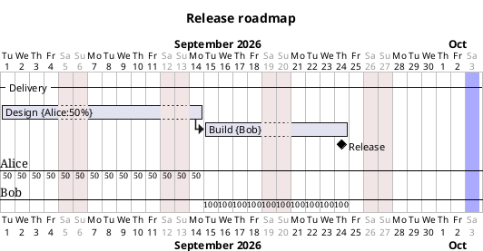

# PlantUML Ultimate

PlantUML Ultimate is a local-first, browser-based editor for creating and maintaining PlantUML Gantt, Sequence, Use Case, Class, Activity, and WBS diagrams. It combines a source-code editor with a directly interactive diagram while keeping the PlantUML text as the single source of truth.

The application runs entirely in the browser. Diagram rendering, editing, workspace recovery, and exports do not require a PlantUML server.

Try the hosted application at [plantuml.brosenius.se](https://plantuml.brosenius.se).

## Highlights

- Diagram-type chooser for Gantt, Sequence, Use Case, Class, Activity, and WBS documents
- CodeMirror editor with diagram-specific syntax highlighting, diagnostics, quick fixes, and context-aware completion
- Semantic reference highlighting, navigation, and document-wide rename actions
- Official PlantUML rendering through the browser-local `@plantuml/core` engine
- Code, split, and diagram-only views
- Multiple open documents with reorderable tabs and independent per-document settings
- Visual task and milestone editing with immediate drag feedback
- Dependency creation and editing directly on the diagram
- Task, dependency, and divider notes
- Resource assignments, capacities, workload analysis, and visible over-allocation warnings
- Project titles, calendars, closed days, date exceptions, scale controls, and today highlighting
- Unified undo and redo for code and visual operations
- Native file access where supported, with upload/download fallbacks
- SVG and PNG export
- Automatic local workspace recovery and portable workspace backups
- Installable desktop and mobile app with offline startup after the first visit
- Keyboard-accessible menus, dialogs, diagram objects, and commands
- Automated validation and a production offline smoke test before deployment, with full Chromium, Firefox, and WebKit coverage in CI
- Light, dark, and system themes

## Requirements

- Node.js 20 or newer
- npm 10 or newer
- A current version of Chromium, Firefox, or Safari

No Java installation or external PlantUML server is required.

## Install and run

Clone the repository, then install the dependencies:

```sh
npm install
```

Start the development server:

```sh
npm run dev
```

Open the URL printed by Vite, normally [http://localhost:5173](http://localhost:5173).

Create a production build with:

```sh
npm run build
```

The static production files are written to `apps/web/dist`.

## Install and use offline

Open the hosted application in a browser that supports app installation. When the browser offers installation, an **Install app** button appears in the status bar. The installed app opens in its own window and continues to store documents locally in the same browser profile.

After the first successful visit, the editor shell and local PlantUML renderer are cached for offline startup. The status bar reports when the browser is offline; edits, history, and workspace recovery continue to use local storage. Reconnect before opening uncached external links or downloading browser updates.

On desktop browsers that support PWA file handling, the installed app registers for `.puml` and `.plantuml` files. Opening one from the operating system loads it in a new tab and keeps its file handle, so **Save** writes back to the same file after the browser grants access.

When a new deployed version has finished downloading, the status bar shows **Update available**. Selecting it activates the new version and reloads the editor while preserving the locally saved workspace.

## Getting started

Creating a document opens a diagram-type chooser. The toolbar, Add menu, settings, editor assistance, preview, and visual inspectors adapt to Gantt, Sequence, Use Case, Class, Activity, or WBS editing.

Enter or paste a complete PlantUML Gantt document in the code editor:



The preview updates automatically. Invalid or incomplete source is reported without silently replacing the last successful preview.

## Sequence diagrams

Sequence documents support the common PlantUML object and interaction families through both source editing and diagram-specific screens:

- Participants: `participant`, `actor`, `boundary`, `control`, `entity`, `database`, `collections`, and `queue`, including aliases, stereotypes, stereotype spots, colors, order, creation, and participant boxes
- Messages: solid, dotted, open-head, cross-head, circle-ended, incoming, outgoing, found, and lost arrows, including color/style modifiers, anchors, activation shortcuts, and return messages
- Structures: `alt`, `opt`, `loop`, `par`, `break`, `critical`, and `group` fragments with branches and colors
- Annotations and flow: `note`, `hnote`, `rnote`, multiline references, activations, deactivation, destruction, separators, delays, spacing, duration arrows, page breaks, and autonumber controls
- Presentation: titles, headers, footers, Teoz layout, message alignment and wrapping, participant/box padding, and Sequence-specific colors

The Add menu creates participants, messages, fragments, activations, notes, references, participant boxes, and timeline controls. Clicking supported diagram objects opens their inspector; participants and messages can also be reordered or reconnected by dragging. The code editor remains the authoritative escape hatch for valid PlantUML syntax that does not need a dedicated visual control.

## Use Case, Class, Activity, and WBS diagrams

The other diagram editors provide the same source-first workflow with diagram-specific creation tools and inspectors:

- **Use Case** supports actors, use cases, packages, notes, relationships, endpoint reconnection, reordering, and general diagram settings.
- **Class** supports classes and related entity kinds, packages, notes, relationships, structured fields and methods, member parameters, type completion, and general diagram settings.
- **Activity** supports actions, partitions, notes, control structures, terminals, arrows, visual reordering, and connection workflows.
- **WBS** supports node creation, structured branch editing, subtree movement, relationships, colors, and keyboard or pointer reordering.

Supported objects can be selected directly in the preview. Visual edits generate minimal PlantUML source changes and participate in the same undo history as code edits.

Use the view buttons in the toolbar to switch between:

- `1 · code` — editor only; the heavy renderer is unloaded
- `2 · split` — source and diagram together
- `3 · diagram` — diagram only

## Application menus

### File

- **New** creates another document tab.
- **Open…** opens a `.puml` or `.plantuml` file in a new tab.
- **Save** writes to the current file when the browser has a file handle. Otherwise it behaves like Save As.
- **Save As…** chooses a new file or downloads the current source, depending on browser support.
- **Backup workspace…** downloads a JSON backup containing every open document and shared workspace settings.
- **Restore workspace…** replaces the current open workspace with a previously created backup.
- **Export → SVG / PNG** exports the latest successful diagram render.

### Add

The menu adapts to the active diagram type. For example, Gantt documents offer tasks, milestones, and dividers; Sequence documents offer participants, messages, fragments, and timeline structures; and the remaining editors expose their supported objects, relationships, notes, and containers.

The command palette, opened with `Cmd/Ctrl + Shift + P`, also exposes file, editing, view, project, resource, and export commands.

## Working with tasks

Click anywhere on a task box to select it and open the Task Inspector. From there you can edit:

- Name
- Start date
- End date or duration
- Color
- Completion percentage
- Assigned people and allocation percentages
- Task note and note position

The arrow buttons between End and Duration convert one representation into the other using the project calendar. For example, an end date can be converted to the corresponding working-day duration.

On the diagram:

- Drag a dated task horizontally to change its date.
- Drag a task vertically to reorder its source statements.
- Drag the right resize handle to change its duration.
- Hold Shift while moving or resizing to snap by weeks where applicable.
- Hover a task to see resolved dates, duration, completion, people, and dependency navigation.

Relative tasks display their calculated start dates from the dependency chain. Visual edits are converted into minimal source changes and recorded in the same undo history as code edits.

## Milestones

Milestones can use either a fixed date or a relative date:

```plantuml
[Code freeze] happens 2026-09-18
[Production release] happens at [Build]'s end
```

Click a milestone to open the Milestone Inspector. Milestones can be renamed, recolored, annotated, and reordered. Fixed milestones can also be moved horizontally. Relative milestones remain anchored to their dependency and cannot be moved horizontally until converted to a fixed date.

## Dependencies

Select a task to reveal its connection handle, then drag the handle to another task. The destination anchor is highlighted when it is a valid drop target.

Click a dependency line or arrowhead to inspect it. The Dependency Inspector supports relation, offset, color, line style, and notes. Arrow-note leader lines attach to the actual rendered dependency path, including routed and curved arrows.

Example dependency syntax:

```plantuml
[Testing] starts at [Build]'s end
[Sign-off] happens at [Testing]'s end
```

## Dividers and notes

Dividers organize large diagrams and can be reordered by dragging:

```plantuml
-- Backend --
[API] lasts 5 days

-- Frontend --
[Web client] lasts 6 days
```

Tasks and dependency arrows can have shorthand or block notes:

```plantuml
[Build] lasts 5 days
note right: Confirm the deployment window

[Test] starts at [Build]'s end
note bottom
Run the full regression suite
end note
```

Studio lays out task and dependency notes separately to avoid overlap.

## People, allocation, and workload

Assign one or more people in the Task Inspector. Each assignment has a name and allocation percentage; allocation defaults to 100%. Existing names in the active document are offered as completions.

Equivalent source syntax:

```plantuml
[Implementation] on {Alice:50%} {Bob:100%} lasts 10 days
```

Open **Resources** to:

- Review daily or weekly workload
- Set each person's capacity
- Rename people throughout the document
- Filter the diagram by person
- Open tasks contributing to a workload peak

People and capacity settings are isolated per document tab. If allocation exceeds capacity, a prominent warning appears beneath the main diagram. It shows the person, peak allocation, configured capacity, affected days, and conflicting tasks. Use **Review workload** in the warning to open the detailed workload screen.

## Project and calendar settings

Open **Project** to edit:

- Diagram title
- Project start date
- Daily, weekly, or monthly scale and zoom
- Closed weekdays, ordered Monday through Sunday
- Closed or reopened date ranges
- Today-line visibility and color
- Footbox visibility

These settings remain ordinary PlantUML source, for example:

```plantuml
title Delivery plan
Project starts 2026-09-01
printscale weekly zoom 2
saturday are closed
sunday are closed
2026-09-21 to 2026-09-23 are closed
2026-09-22 is opened
today is colored in LightBlue
hide footbox
```

Moving and resizing tasks respects configured closed weekdays and date exceptions.

## Editor assistance

The editor provides:

- Diagram-aware syntax coloring that respects complete identifiers rather than highlighting keywords inside names
- Context-aware completion for supported PlantUML diagram statements
- Completion of existing task names when starting a new task statement with `[`
- Completion of people, colors, dependency targets, Sequence participants, and Class member types already present in the document
- Semantic highlighting of every reference to the symbol under the cursor
- **Find references**, previous/next reference navigation, and document-wide **Rename** from the editor or diagram context menu
- Diagnostics for malformed or unsupported statements
- Persistent quick-fix controls for repairable source problems
- A preserved-syntax panel for valid PlantUML lines that Studio does not yet edit visually
- A **Copy code** button for copying the full current source

PlantUML syntax that is not understood by the visual Gantt adapter is preserved whenever possible. It may still be rendered by PlantUML even if no visual editing control is available.

Semantic reference and rename support currently covers Gantt tasks and people, Sequence participants, Use Case actors, use cases and packages, Class entities and packages, Activity actions and partitions, and WBS nodes. Renames are syntax-aware and update declarations and references without replacing unrelated text.

## Tabs, persistence, and document safety

Each open file has its own tab. Tabs can be reordered by dragging and provide context-menu actions for duplicate, close, and close other tabs.

The workspace is saved locally in IndexedDB, with local-storage fallback when IndexedDB is unavailable. Recovery includes open documents, source, filenames, dirty state, view mode, split position, zoom, cursor position, and theme.

Important behavior:

- Unsaved tabs show a dirty indicator.
- Closing a dirty tab asks for confirmation.
- Leaving or refreshing the page with dirty tabs triggers the browser's unsaved-change warning.
- File-system handles last only for the current browser session.
- Workspace recovery is convenient local persistence, not a replacement for saving files or downloading backups.

See [Persistence and files](docs/persistence-and-files.md) for implementation details.

## Keyboard shortcuts

| Shortcut                     | Action                               |
| ---------------------------- | ------------------------------------ |
| `Cmd/Ctrl + N`               | New document                         |
| `Cmd/Ctrl + O`               | Open document                        |
| `Cmd/Ctrl + S`               | Save active document                 |
| `Cmd/Ctrl + W`               | Close active tab                     |
| `Cmd/Ctrl + Z`               | Undo                                 |
| `Shift + Cmd/Ctrl + Z`       | Redo                                 |
| `Cmd/Ctrl + 1`               | Code view                            |
| `Cmd/Ctrl + 2`               | Split view                           |
| `Cmd/Ctrl + 3`               | Diagram view                         |
| `Cmd/Ctrl + Shift + P`       | Command palette                      |
| `Up / Down`                  | Move focus between diagram tasks     |
| `Enter / Space`              | Select the focused task or milestone |
| `Alt + Left / Right`         | Move the focused item one day        |
| `Alt + Shift + Left / Right` | Resize the focused task one day      |
| `Ctrl + Up / Down`           | Reorder the focused item             |
| `?`                          | Open Help when not typing            |
| `Escape`                     | Close the active menu or dialog      |

Menus and modal dialogs support keyboard focus management. Diagram task and dependency hit targets are exposed as semantic controls for keyboard and assistive-technology users.

## Rendering and privacy

The official PlantUML engine runs in a hidden browser iframe and communicates with the application through `postMessage`. Rendering requests are serialized, stale results are ignored, and the renderer automatically restarts once after a startup failure.

Source is not sent to an external rendering service. The renderer is unloaded in code-only view to reduce resource usage.

See [Architecture](docs/architecture.md) and [Rendering](docs/rendering.md) for more detail.

## Browser behavior

The committed Playwright suite defines Chromium, Firefox, and WebKit projects. All three browser engines are CI quality gates and run before GitHub Pages deployment. A small number of browser-specific pointer, focus, and clipboard assertions are omitted where Playwright automation differs from the corresponding browser's interactive behavior.

The File System Access API is currently available only in some browsers. When it is unavailable:

- Open uses a standard file picker.
- Save As downloads a `.puml` file.
- Save may download a new file instead of updating an existing file in place.

Core editing, local rendering, tabs, backups, and exports remain available.

## Development commands

```sh
# Start the Vite development server
npm run dev

# Format source files
npm run format

# Check formatting without changing files
npm run format:check

# Run ESLint
npm run lint

# Run unit tests
npm test

# Run TypeScript project checks
npm run typecheck

# Create a production build
npm run build

# Run the full Chromium, Firefox, and WebKit browser suite
npm run test:e2e

# Run only Chromium browser tests
npm run test:e2e:chromium

# Run only Firefox browser tests
npm run test:e2e:firefox

# Run only WebKit browser tests
npm run test:e2e:webkit

# Run benchmarks
npm run bench
```

`npm run validate` runs linting, formatting checks, unit tests, type checking, and the production build. CI runs that validation followed by the complete Chromium, Firefox, and WebKit suites. The GitHub Pages deployment uses the same gate and uploads Playwright traces and screenshots when a browser test fails.

Install Playwright's browser runtimes before the first end-to-end run if necessary:

```sh
npx playwright install chromium firefox webkit
```

## Repository structure

```text
apps/web/                    React application and browser integration
packages/diagram-gantt/      Gantt parser, model, and source transformations
packages/diagram-sequence/   Sequence parser, model, and source transformations
packages/diagram-usecase/    Use Case parser, model, and source transformations
packages/diagram-class/      Class parser, model, and source transformations
packages/diagram-activity/   Activity parser, model, and source transformations
packages/diagram-wbs/        WBS parser, model, and source transformations
packages/editor-core/        Framework-independent command and history logic
packages/language-core/      Diagram adapter contracts
packages/language-plantuml/  PlantUML detection and adapter registry
tests/e2e/                   Cross-browser Playwright tests
docs/                        Architecture decisions and implementation notes
benchmarks/                  Large-document performance benchmarks
examples/                    Example PlantUML documents
```

## Design principle

PlantUML source is the persistent document representation. The parser, diagnostics, completions, renderer, inspectors, and diagram interactions all consume that source. Visual operations generate source edits instead of maintaining a second hidden project model.

This keeps saved files portable: they remain regular PlantUML documents that can be opened in other compatible tools.

## Current scope

The visual interaction layer supports PlantUML Gantt, Sequence, Use Case, Class, Activity, and WBS diagrams. Each implementation targets its commonly used structural, annotation, layout, and style families; it does not claim a dedicated screen for every obscure PlantUML grammar combination. Valid source remains editable and renderable even when a construct has no specialized visual control.

Large renderer assets are expected in the production build because PlantUML and Graphviz run locally in the browser.

## License

See [LICENSE](LICENSE).
