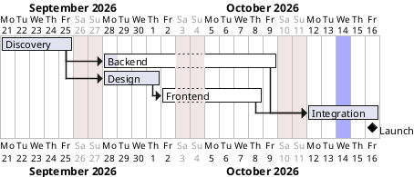

# Demo video script: Progress forecast, "when will we really launch?"

Length: about 1 minute 45 seconds, 8 narration clips (~275 words). Recorded at 1920×1080 from `main`, in Gantt **diagram** view so the chart has the full width.

The clip text lives in [`scripts/demo-video/narration-forecast.json`](../scripts/demo-video/narration-forecast.json). If you edit a line, edit it there too, since the recorder will read that file.

## The story

One question, answered in five steps:

1. **Hook.** The plan says launch on 16 Oct, but today is 2 Oct and work is behind.
2. **Turn it on.** Progress forecast + a status date.
3. **The answer.** Projected finish 21 Oct, +3 working days, plan vs forecast bars.
4. **The why.** Click Backend: "Why did this move?" with plan vs forecast dates.
5. **The options.** Finish causes, a what-if estimate, then Apply to plan.

The key message is that the forecast never touches the source until you choose to apply it.

## The demo project

A small website relaunch with one clear culprit. Paste this into a new Gantt diagram. I checked it in the running app with status date **2026-10-02**, and every number in the script comes from that run.



What the app shows with this plan:

| Moment                              | What appears                                                                                                                     |
| ----------------------------------- | -------------------------------------------------------------------------------------------------------------------------------- |
| Forecast on, status date 2026-10-02 | Projected finish **Oct 21**, **+3 working days** from plan, 1 root cause affecting finish                                        |
| Backend selected                    | Plan Sep 28 – Oct 9, forecast Oct 2 – Oct 14, "missed by 3 working days", 10% complete, 9 working days remain                    |
| Project finish causes               | 1 root task (Backend), 2 linked successors, milestone Launch                                                                     |
| Remaining work set to 6             | Projected finish **Oct 16**, **+0 working days**, "1 saved remaining-work estimate"                                              |
| Apply to plan dialog                | Planned finish 2026-10-16 → proposed 2026-10-21. Backend becomes `lasts 13 days`; Integration and Launch move through dependency |

Two things I deliberately fixed in the scenario: Design is 100% complete (otherwise it becomes a second late task and muddies the "one root cause" message), and Frontend has an explicit `0% completed` (otherwise a "1 missing progress" warning appears).

## How to produce the voice in ElevenLabs

1. Generate **one audio file per clip** below. Paste only the quoted narration text, without the heading.
2. Name each file with its clip ID, for example `01-intro.mp3`, `02-turn-on.mp3`, …, `08-outro.mp3` (mp3, wav or m4a all work).
3. Put all 8 files in one folder and send me the path.

I'll re-record the screen so each scene lasts exactly as long as its clip, then build the final MP4.

Suggested voice settings, the same as the WBS video so the two sound like a series: a warm, confident narrator voice, Stability ≈ 45–55 %, Similarity ≈ 75 %, Style ≈ 15–25 %, speaker boost on. Use the same voice and settings for every clip.

Pronunciation notes: "PlantUML" is "plant U-M-L". Dates are written out in words on purpose ("October twenty-first") so the voice doesn't read "21/10". If the voice gets "Gantt" wrong (it rhymes with "want"), write it phonetically.

---

## 01-intro

**On screen:** The Gantt chart above, already loaded and showing progress fills (Discovery and Design complete, Backend barely started). The cursor rests near the Launch milestone on 16 Oct, then circles it.

> Your plan says the website launches on the sixteenth of October. But it's October second, and the work isn't going quite as planned. So when will you really launch?

## 02-turn-on

**On screen:** Click **Progress forecast: Off** in the preview toolbar, so it flips to On. Click the **As of** date field and set 2026-10-02. The purple "today" line appears on the chart.

> In PlantUML Ultimate, turn on Progress forecast and pick a status date. The app looks at how much of each task is complete, works out what's left, and projects the whole plan forward, respecting your dependencies and your closed weekends.

## 03-result

**On screen:** The forecast summary bar comes into focus: "Projected finish Oct 21" and the red "+3 working days from plan" badge. The cursor then sweeps along the chart: the grey plan bars, the blue forecast bars, and the hatched section running past the planned finish.

> And there's the answer. Projected finish: October twenty-first. Three working days later than planned. On the chart, the grey bar is the plan, the blue bar is the forecast, and the hatching marks work that's running past its planned finish.

## 04-why

**On screen:** Click **Backend** in the task list. The inspector shows "WHY DID THIS MOVE?": Current plan Sep 28 – Oct 9, Forecast Oct 2 – Oct 14, "missed by 3 working days", "10% complete. 9 working days remain." The cursor underlines the two date ranges in turn.

> But a number isn't enough. You need to know why. Click Backend, and the inspector explains it: planned to finish on October ninth, forecast to finish on the fourteenth. It's only ten percent done, with nine working days remaining.

## 05-causes

**On screen:** Click **1 root cause affecting finish**. The panel switches to PROJECT FINISH CAUSES: Backend, "10% complete · 9 working days remain", "2 linked successors · Milestones: Launch". The cursor moves down the entry. Optionally click Discovery in the list to show "On plan".

> Zoom out, and the project finish causes tell you where to act. One root task is moving the release: Backend. It holds up two linked tasks, and the Launch milestone. Everything else is on plan.

## 06-what-if

**On screen:** Select Backend again. Type **6** in **Remaining work · working days** and press Enter. The summary bar changes to "Projected finish Oct 16", "+0 working days from plan", and a "1 saved remaining-work estimate" note appears. The code pane on the left stays unchanged (use split view for this scene so that is visible).

> Now try a what-if. Suppose Backend only needs six more working days. Type it in, and the projected finish snaps back to the sixteenth. Plus zero days. Your source file hasn't changed, so it's safe to explore.

## 07-apply

**On screen:** Click **Use automatic** so the forecast returns to Oct 21. Click **Apply to plan…**. The dialog lists Backend (lasts 13 days), Integration and Launch (Moves through dependency) with planned vs proposed dates. The cursor goes down the table, then clicks **Apply to plan**. The summary bar now reads +0 working days, and `[Backend] lasts 13 days` is visible in the code.

> When the delay is real, you can accept it. Apply to plan shows exactly which tasks will change: Backend gets longer, Integration and Launch move with it. Review the changes, apply them, and the plan now matches reality.

## 08-outro

**On screen:** An end card fades in: "Know where you really stand. Progress forecast, in PlantUML Ultimate."

> Know where you really stand, see why, and test your options. Progress forecast, in PlantUML Ultimate.

---

## Rebuilding the video

Start the `web-alt` launch configuration (port 5185) on `main`, then:

```bash
node scripts/demo-video/record-forecast.mjs --audio <folder-with-clips>
node scripts/demo-video/build.mjs --audio <folder-with-clips> --recording scripts/demo-video/out/recording-forecast --out scripts/demo-video/out/forecast-demo.mp4
```

Both scripts need `ffmpeg`/`ffprobe` on the PATH, or set `FFMPEG` and `FFPROBE` to their paths (`brew install ffmpeg` provides both).

Known cosmetic detail: once Backend is selected, the app pins a small dependency card for Integration at the right edge of the chart. It is app behaviour, not part of the recording script.
