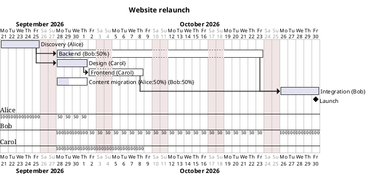

# Demo video script: Reports → Task check-in, "who's on track?"

Length: about 2 minutes (the forecast video ran about 10% longer than its word-count estimate), 8 narration clips (~300 words). Recorded at 1920×1080 from `main`, with the Reports dialog as the star of the video.

The clip text lives in [`scripts/demo-video/narration-task-check-in.json`](../scripts/demo-video/narration-task-check-in.json). If you edit a line, edit it there too, since the recorder will read that file.

## The story

One chore, removed: chasing the team for status updates.

1. **Hook.** It's Friday, you need real status, and writing the same email to everyone is tedious.
2. **Open.** More → Reports… → Task check-in.
3. **Scope.** Which tasks to ask about (Ongoing), as-of date, reply-by date.
4. **People.** Who has what, and how a shared task is handled.
5. **Preview.** One message per person: only their tasks, overdue work flagged, three standard questions.
6. **Customize.** Intro and sign-off, Gantt chart of their tasks, combined summary.
7. **Copy.** Copy for email, paste into your own mail app. Nothing is sent from the app.
8. **Outro.**

The key message is that the app prepares the messages but never sends anything; you stay in control.

## The demo project

The same website relaunch plan as the forecast video, now with people assigned, plus one shared task. Paste this into a new Gantt diagram. I checked it in the running app with as-of date **2026-10-02** and reply-by **2026-10-06**; every fact in the script comes from that run.



What the app shows with this plan (Task filter **Ongoing**, locale with ISO dates, e.g. Swedish):

| Moment           | What appears                                                                                                                                                                                                              |
| ---------------- | ------------------------------------------------------------------------------------------------------------------------------------------------------------------------------------------------------------------------- |
| Summary line     | 3 people · 3 unique tasks · 4 assignments                                                                                                                                                                                 |
| Why only 3 tasks | Discovery and Design are 100% complete, Integration and Launch haven't started, so "Ongoing" leaves them out                                                                                                              |
| People list      | Alice · 1 task, Bob · 2 tasks, Carol · 1 task                                                                                                                                                                             |
| Alice's message  | Subject "Website relaunch — task check-in for Alice — 2026-10-02"; one task, **Content migration**: recorded progress 40%, planned 2026-09-28 – 2026-10-01, "Past planned finish", "Shared with Bob" (highlighted in red) |
| Bob's message    | Content migration (shared with Alice) and **Backend**: 10%, planned 2026-09-28 – 2026-10-23, "Planned to be ongoing"                                                                                                      |
| Carol's message  | **Frontend**: 0%, planned 2026-10-02 – 2026-10-08, "Planned to be ongoing"                                                                                                                                                |
| Every task       | "Confirm: On track / At risk / Blocked / Complete · Updated progress · Expected finish · Blockers or support needed"                                                                                                      |
| Copy for email   | Footer status: "Copied for email. Use normal paste into a rich-text email body."                                                                                                                                          |

Three details in the scenario are deliberate. Alice and Bob are given 50% on the shared task (and Bob 50% on Backend) so nobody is over-allocated, which would otherwise put a red warning banner on the chart; PlantUML stretches Backend to 2026-10-23 because of the part-time allocation. The `title` line also gives the report a proper name (otherwise it says "untitled.pumlu"). Content migration is overdue and shared, so it shows both the red flag and the shared-task handling in one place.

Known cosmetic detail: the line "Document: untitled.pumlu" in the email still shows the file name, because a document can't be renamed from the UI without a native file picker. It is small and doesn't affect the story.

## How to produce the voice in ElevenLabs

1. Generate **one audio file per clip** below. Paste only the quoted narration text, without the heading.
2. Name each file with its clip ID, for example `01-intro.mp3`, `02-open.mp3`, …, `08-outro.mp3` (mp3, wav or m4a all work).
3. Put all 8 files in one folder and send me the path.

I'll record the screen so each scene lasts exactly as long as its clip, then build the final MP4.

Use the same voice and settings as the forecast and WBS videos so all three sound like a series: a warm, confident narrator voice, Stability ≈ 45–55 %, Similarity ≈ 75 %, Style ≈ 15–25 %, speaker boost on.

Pronunciation notes: "PlantUML" is "plant U-M-L". "Gantt" rhymes with "want". Everything else is plain English.

---

## 01-intro

**On screen:** The Website relaunch Gantt chart with its team-coloured task bars, in diagram view. The cursor drifts slowly across the bars, pausing near a couple of names.

> It's Friday afternoon, and you need to know where the project really stands. So you open the plan, work out who owns what, and write the same email to everyone on the team. Task check-in does that part for you.

## 02-open

**On screen:** Click **More**, then **Reports…**. The dialog opens on **Task check-in**: options on the left, the email preview on the right. The cursor rests on the Report type selector.

> Open Reports from the More menu, and choose Task check-in. It works from the Gantt chart you already have: your tasks, your dates, and the people assigned to them.

## 03-scope

**On screen:** The **Tasks** selector shows **Ongoing**. The cursor opens it briefly to show the other choices (All tasks, Upcoming, Overdue, Completed), then back to Ongoing. Click **As-of date** and set 2026-10-02, then **Reply by** and set 2026-10-06. The summary line reads "3 people · 3 unique tasks · 4 assignments".

> First, pick what to ask about. Ongoing is the default: work that has started, or is already past its planned finish. Finished tasks, and work that hasn't begun, stay out of the way. Set the as-of date, and an optional reply-by date, so people know when you need an answer.

## 04-people

**On screen:** Scroll the options panel to **People**. The list shows Alice · 1 task, Bob · 2 tasks, Carol · 1 task. The cursor goes down the three names, then points at "4 assignments" in the summary line to show that one task is counted for two people.

> Everyone assigned to those tasks appears here, with the number of tasks they need to confirm. Alice has one, Bob has two, and Carol has one. Content migration is shared between Alice and Bob, so it appears in both messages, and says so.

## 05-preview

**On screen:** The preview shows Alice's message. The cursor underlines the subject line, then scrolls the email: the greeting, the red Content migration card (40%, planned dates, "Past planned finish", "Shared with Bob"), and the three reply questions beneath it.

> Then preview each message. This is Alice's: only her own tasks, with the recorded progress, the planned dates, and a clear flag when work is past its planned finish. And every task ends with the same short questions: is it on track, what's the updated progress, and what's blocking you?

## 06-customize

**On screen:** Scroll the options to **Message wording**. Type a new introduction ("Quick Friday check-in: please confirm where your tasks stand.") and a sign-off, and the preview updates. Tick **Include Gantt chart**; "Chart ready" appears and the timeline shows in the email. Switch **Output** to **Combined coordinator summary** to show the single audience message, then switch back to Individual messages.

> Make it yours. Edit the introduction and the sign-off, and they're remembered for next time. Add a Gantt chart showing just that person's tasks. Or switch to a combined summary, if you'd rather read everything in one place.

## 07-copy

**On screen:** Click **Copy for email**. The footer reads "Copied for email. Use normal paste into a rich-text email body." Select Bob in **Preview recipient**, click Copy for email again, then select Carol.

> When it looks right, click Copy for email, and paste it straight into your mail app. Nothing is sent from here, so you stay in control. Then move on to Bob and Carol the same way.

## 08-outro

**On screen:** An end card fades in: "Know who's on track, and who needs a nudge. Task check-in, in PlantUML Ultimate Reports."

> Know who's on track, and who needs a nudge. Task check-in, in PlantUML Ultimate Reports.

---

## Rebuilding the video

Start the `web-alt` launch configuration (port 5185) on `main` (run `npm install` first if the preview shows "Preview failed"), then:

```bash
node scripts/demo-video/record-task-check-in.mjs --audio <folder-with-clips>
node scripts/demo-video/build.mjs --audio <folder-with-clips> --recording scripts/demo-video/out/recording-task-check-in --out scripts/demo-video/out/task-check-in-demo.mp4
```

Both scripts need `ffmpeg`/`ffprobe` on the PATH, or set `FFMPEG` and `FFPROBE` to their paths.
